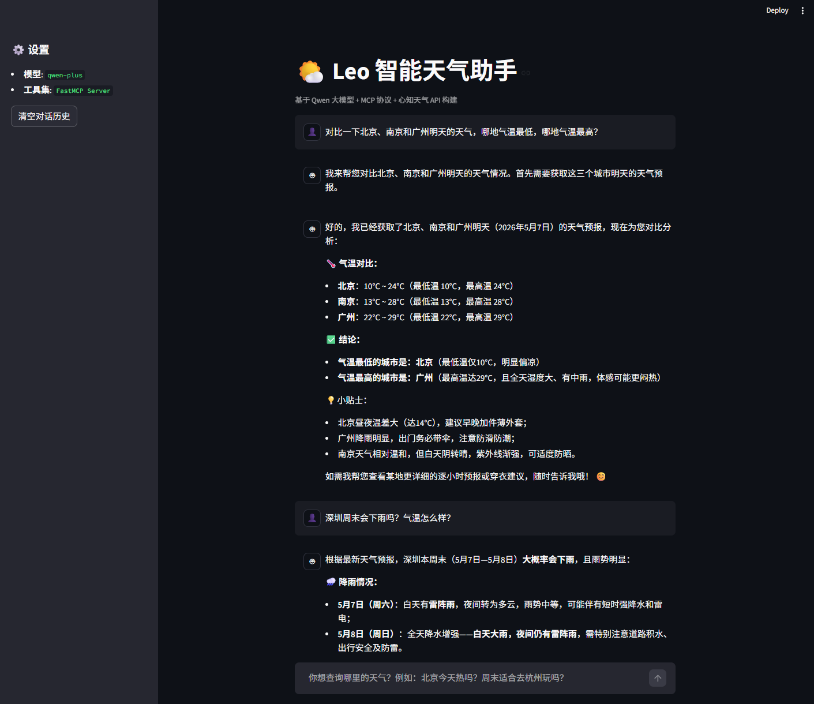

# Leo 智能天气助手 (Leo Weather Assistant)

这是一个基于 **Qwen (通义千问)** 大语言模型、**MCP (Model Context Protocol)** 协议以及 **心知天气 (Seniverse)** API 构建的智能化天气查询助手。项目采用 **Streamlit** 搭建前端界面，实现了流式对话、多轮交互以及工具自动调用的完整闭环。

## 🌟 项目亮点

- **流式输出 (Streaming)**：实时展现 AI 的思考过程，响应极速。
- **MCP 架构**：通过 FastMCP 协议解耦大模型与外部工具，易于扩展。
- **多轮对话**：支持上下文理解，可以连续追问天气对比、旅游建议等。
- **可视化工作流**：在界面上直观展示大模型调用本地工具的具体参数与返回结果。
- **双维度查询**：不仅支持当前实时天气查询，还支持未来 3 天的天气预报。

## 📸 运行截图



## 🛠️ 技术栈

- **LLM**: 通义千问 (qwen-plus)
- **MCP Framework**: [FastMCP](https://github.com/jlowin/fastmcp)
- **Weather Data**: [心知天气 API](https://www.seniverse.com/)
- **Frontend**: [Streamlit](https://streamlit.io/)
- **Client**: OpenAI SDK (兼容模式)

## 🚀 快速开始

### 1. 克隆项目
```bash
git clone <your-repo-url>
cd <your-repo-name>
```

### 2. 安装依赖
确保你的环境中已安装 Python 3.10+，然后运行：
```bash
pip install streamlit fastmcp openai httpx requests
```

### 3. 配置 API Key
在代码中填入你的 API 密钥（建议后续通过环境变量或 `.env` 文件管理）：
- **心知天气 API Secret**: 在 `leo_server.py` 中修改 `API_SECRET`。
- **DashScope (阿里) API Key**: 在 `app.py` 中修改 `DASHSCOPE_API_KEY`。

### 4. 启动程序
由于项目采用 MCP 架构，`app.py` 会在后台自动启动并连接 `leo_server.py`，你只需运行前端脚本：
```bash
streamlit run app.py
```

## 📂 文件结构

```text
├── app.py             # Streamlit 前端应用，负责 UI 渲染与大模型逻辑
├── leo_server.py      # MCP 服务端，定义了 get_weather 和 get_forecast 工具
└── README.md          # 项目说明文档
```

## 💡 使用示例

- "北京今天天气怎么样？"
- "我想去上海玩三天，能帮我查一下预报吗？"
- "深圳和杭州哪个地方明天更暖和？"

## ⚖️ 许可证

MIT License
